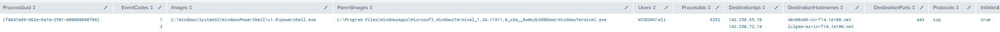

# Powershell Making Network Connections

## Objective

Detect PowerShell processes that establish network connections.

---

## MITRE ATT&CK

- Tactic(s): Execution

- Technique(s)
  - T1059.001: Command and Scripting Interpreter: PowerShell

---

## Why This Matters

Threat actors often use PowerShell commands to invoke connections to malicious IP addresses. From this, they can download malicious scripts to take control of the device or deploy ransomware.

---

## SPL Query

```spl
index=* (EventCode=1 OR EventCode=3) 
| stats
    values(EventCode) as EventCodes
    values(Image) as Images
    values(ParentImage) as ParentImages
    values(User) as Users
    values(ProcessId) as ProcessIds
    values(DestinationIp) as DestinationIps
    values(DestinationHostname) as DestinationHostnames
    values(DestinationPort) as DestinationPorts
    values(Protocol) as Protocols
    values(Initiated) as Initiated
    by ProcessGuid
| search Images="*\\powershell.exe"
| where isnotnull(mvfind(EventCodes, "^1$")) AND isnotnull(mvfind(EventCodes, "^3$"))

```

---

## Test Procedure

Ran the following commands:

1. Test-NetConnection -ComputerName "google.com" -Port 443

---

## Sample Output



---

## Fields Used

| Field | Purpose |
|------|---------|
|EventCode | Used to determine if a command is run as well as if a network connection was attempted |
| Image | Used to specifically search for PowerShell commands |

---

## False Positives

Simple network troubleshooting by tech support will flag this alert, as well as any legitimate software or administrative command that uses powershell to run network commands.

---

## Improvements

- Filter out any software where this behavior is expected activity
- Filter by specific ports often correlated with malicious activity
- Make it so it only flags for connections to external IP addresses
- Add IP reputation as part of detections

---

## References

- <https://attack.mitre.org/>
