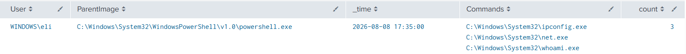


# Repeated Use of Reconnaissance Commands

## Objective

Identify potential post-compromise reconnaissance by detecting multiple built-in Windows discovery commands executed by the same user within a five-minute period.

---

## MITRE ATT&CK

- Tactic: Discovery

- Technique(s):

- T1033: System Owner/User Discovery (whoami)

- T1082: System Information Discovery (hostname, systeminfo)

- T1016: System Network Configuration Discovery (ipconfig)

---

## Why This Matters

While these commands in isolation are often benign (ex: tech support may use 'ipconfig' to help troubleshoot network issues), multiple of these commands in succession is often indicative of an actor trying to get information about the device they are on.

---

## SPL Query

```spl

index=* EventCode=1

(Image="*\\whoami.exe"

OR Image="*\\hostname.exe"

OR Image="*\\ipconfig.exe"

OR Image="*\\systeminfo.exe"

OR Image="*\\net.exe")

| bucket _time span=5m

| stats values(Image) as Commands count by User _time

| where count >= 3

```

---

## Test Procedure

Ran the following commands:

1. whoami /all

2. net localgroup administrators

3. ipconfig

---

## Sample Output



---

## Fields Used

| Field | Purpose |
| ------ | --------- |
| Image | Needed to specify the different reconnaissance commands we want to detect.|
| ParentImage | We want to specifically check processes ran on powershell.exe, which this helps us detect |
 | User | Groups activity by user to correlate multiple commands performed by the same actor |
 | _time | Used to group events into 5-minute windows |

---

## False Positives

This can still be triggered easily by basic troubleshooting performed by the IT or network team.

---

## Improvements

- Create exceptions for known applications, users, or administrative activity that may legitimately trigger the detection.
- Incorporate `ParentImage` and `CommandLine` to distinguish between different execution contexts and command usage.
- Consider the specific arguments and behaviors of each command to improve ATT&CK mapping and reduce false positives.
- Correlate this activity with additional events, such as network connections or PowerShell activity, to increase confidence that the behavior is malicious.

---

## References
