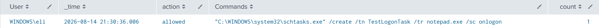

# Scheduled Task Persistence

## Objective

Detect threat actors attempting to gain persistence on a device by running scheduled tasks.

---

## MITRE ATT&CK

- Tactic(s): Persistence

- Technique(s)
  - T1053: Scheduled Task/Job
    - T1053.005: Scheduled Task

---

## Why This Matters

Post-compromise, threat actors often try to maintain persistence through scheduled tasks so that even if the initial malware was remediated, they could maintain their control of the device for malicious purposes.

---

## SPL Query

```spl

index=* EventCode=1 
Image="*schtasks.exe*" 
CommandLine="*/create*" 
| stats values(CommandLine) as Commands count by User _time action

```

---

## Test Procedure

Ran the following command:

1. schtasks /create /tn "TestLogonTask" /tr "notepad.exe" /sc onlogon

---

## Sample Output



---

## Fields Used

| Field | Purpose |
|------|---------|
| EventCode | Identifies process creation events |
| Image | Used to find schtasks execution |
 | CommandLine | Makes the detection specifically for creating scheduled tasks, reducing false positives |

---

## False Positives

- IT maintenance or deployment scripts may use scheduled tasks for patching, configuration changes
- Application installers often use schtasks /create for background updaters
- Monitoring or management agents may create scheduled tasks for legitimate automation or maintenance.

---

## Improvements

- Add exceptions for any known IT management scripts or software that would generate false positives
- Flag tasks configured to run at logon, startup, or other persistence-relevant triggers

---

## References

- <https://attack.mitre.org/>
