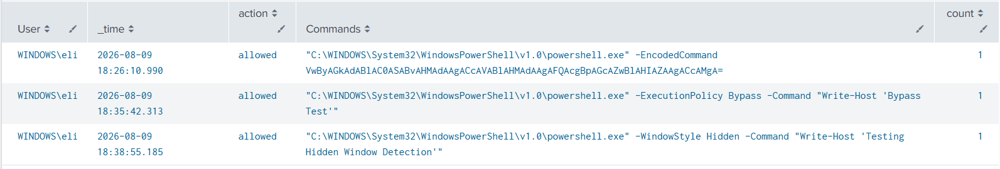

# Suspicious Powershell Commands Executed

## Objective

Detects PowerShell processes using encoded commands, execution-policy bypass, or hidden execution.

---

## MITRE ATT&CK

- Tactic(s):
  - Stealth
  - Execution

- Technique(s):

  - T1027: Obfuscated Files or Information
  - T1564: Hide Artifacts
  - T1059.001: Command and Scripting Interpreter: PowerShell
  
---

## Why This Matters

---

Attackers can use encoded commands to obscure command content, execution policy parameters to weaken PowerShell execution controls, and hidden windows to reduce visibility to the user.

## SPL Query

```spl

index=* EventCode=1
Image="*\\powershell.exe"
(CommandLine="*-EncodedCommand*"
 OR CommandLine="*-enc*"
 OR CommandLine="*-ExecutionPolicy Bypass*"
 OR CommandLine="*-WindowStyle Hidden*")
 | stats values(CommandLine) as Commands count by User _time action

```

---

## Test Procedure

Ran the following commands:

1. powershell.exe -EncodedCommand VwByAGkAdABlAC0ASABvAHMAdAAgACcAVABlAHMAdAAgAFQAcgBpAGcAZwBlAHIAZAAgACcAMgA=

2. powershell.exe -ExecutionPolicy Bypass -Command "Write-Host 'Bypass Test'" 

3. powershell.exe -WindowStyle Hidden -Command "Write-Host 'Testing Hidden Window Detection'"

---

## Sample Output



---

## Fields Used

| Field | Purpose |
| ------ | --------- |
| Image | Used to determine if this is a PowerShell command being run |
| CommandLine | Needed to distinguish crucial PowerShell command parameters |

---

## False Positives

- Various enterprise IT management software use hidden PowerShell windows to execute commands, which would trigger this alert
- The "-enc" portion of the spl query can accidentally trigger any parameter containing "-enc"
  
---

## Improvements

- Create exceptions for any legitimate enterprise software or processes that may trigger this alert
- Correlate this event with the PowerShell process making an external connection, which would make it even more likely to be malicious
- Use regex to prevent "-enc" line from generating false positives

---

## References

- <https://attack.mitre.org/>
